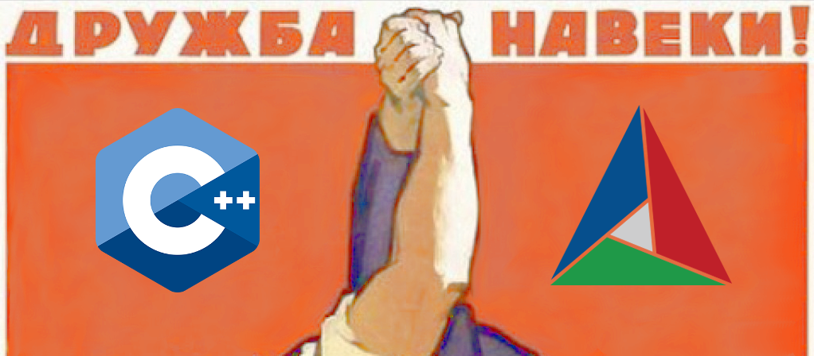

C++ и CMake — братья навек, часть II
====================================



[В предыдущей части](cmake-and-cpp-friendship-forever.md) данного занимательного рассказа говорилось об организации заголовочной библиотеки в рамках генератора систем сборки CMake.

В этот раз добавим к нему компилируемую библиотеку, а также поговорим о компоновке модулей друг с другом.

> Как и прежде, тем, кому нетерпится, могут сразу [перейти в обновлённый репозиторий](https://github.com/izvolov/mylib) и потрогать всё своими руками.

Содержание
----------

1.  [Разделяй](#разделяй)
2.  [Властвуй](#властвуй)

[Разделяй](#содержание)
-----------------------

Первое, что нужно сделать для достижения нашей высокой цели — это разделить разрабатываемое ПО на универсальные изолированные блоки, единообразные с точки зрения пользователя.

В первой части был описан такой стандартный блок — проект с заголовочной библиотекой. Теперь же добавим в наш проект компилируемую библиотеку.

Для этого вынесем реализацию функции `myfunc` в отдельный `.cpp`-файл:

```diff
diff --git a/include/mylib/myfeature.hpp b/include/mylib/myfeature.hpp
index 43db388..ba62b4f 100644
--- a/include/mylib/myfeature.hpp
+++ b/include/mylib/myfeature.hpp
@@ -46,8 +46,5 @@ namespace mylib
 
         \~  \see mystruct
      */
-    inline bool myfunc (mystruct)
-    {
-        return true;
-    }
+    bool myfunc (mystruct);
 }
diff --git a/src/mylib/myfeature.cpp b/src/mylib/myfeature.cpp
new file mode 100644
index 0000000..abb5004
--- /dev/null
+++ b/src/mylib/myfeature.cpp
@@ -0,0 +1,9 @@
+#include <mylib/myfeature.hpp>
+
+namespace mylib
+{
+    bool myfunc (mystruct)
+    {
+        return true;
+    }
+}
```

Затем определим компилируемую библиотеку (`myfeature`), которая будет состоять из полученного на предыдущем шаге `.cpp`-файла. Новой библиотеке, очевидно, требуются уже имеющиеся заголовки, и для того, чтобы это обеспечить, можно и нужно провязать её с имеющейся целью `mylib`. Причём провязка между ними публичная, а это значит, что всё, к чему будет подключена цель `myfeature`, автоматически получит в нагрузку и цель `mylib` ([подробнее про способы провязки](https://cmake.org/cmake/help/v3.14/command/target_link_libraries.html#libraries-for-a-target-and-or-its-dependents)). 

```diff
diff --git a/CMakeLists.txt b/CMakeLists.txt
index 108045c..0de77b8 100644
--- a/CMakeLists.txt
+++ b/CMakeLists.txt
@@ -64,6 +64,17 @@ target_compile_features(mylib INTERFACE cxx_std_17)
 
 add_library(Mylib::mylib ALIAS mylib)
 
+###################################################################################################
+##
+##      Компилируемая библиотека
+##
+###################################################################################################
+
+add_library(myfeature src/mylib/myfeature.cpp)
+target_link_libraries(myfeature PUBLIC mylib)
+
+add_library(Mylib::myfeature ALIAS myfeature)
+
```

Далее сделаем, чтобы новая библиотека тоже устанавливалась в систему:

```diff
@@ -72,7 +83,7 @@ add_library(Mylib::mylib ALIAS mylib)
 
 install(DIRECTORY include/mylib DESTINATION include)
 
-install(TARGETS mylib EXPORT MylibConfig)
+install(TARGETS mylib myfeature EXPORT MylibConfig)
 install(EXPORT MylibConfig NAMESPACE Mylib:: DESTINATION share/Mylib/cmake)
 
 include(CMakePackageConfigHelpers)
```

Нужно обратить внимание, что для цели `myfeature`, как и для `mylib` был заведён псевдоним с префиксом `Mylib::`. То же самое прописано для обеих целей при экспортировании их для установки в систему. Это даёт возможность единообразной работы с целями при любой [схеме связывания](#властвуй).

После этого осталось провязать модульные тесты с новой библиотекой (функцию `myfunc` вынесли из заголовка, так что теперь нужно линковаться):

```diff
diff --git a/test/CMakeLists.txt b/test/CMakeLists.txt
index 5620be4..bc1266c 100644
--- a/test/CMakeLists.txt
+++ b/test/CMakeLists.txt
@@ -4,7 +4,7 @@ add_executable(mylib-unit-tests test_main.cpp)
 target_sources(mylib-unit-tests PRIVATE mylib/myfeature.cpp)
 target_link_libraries(mylib-unit-tests
     PRIVATE
-        Mylib::mylib
+        Mylib::myfeature
         doctest::doctest
 )
```

Заголовки (`Mylib::mylib`) теперь отдельно подключать не нужно, потому что, как уже было сказано, они автоматически подключаются вместе с библиотекой (`Mylib::myfeature`).

И добавим пару нюансов, чтобы обеспечить замеры покрытия с учётом новоприбывшей библиотеки:

```diff
@@ -15,11 +15,16 @@ if(MYLIB_COVERAGE AND GCOVR_EXECUTABLE)
     target_compile_options(mylib-unit-tests PRIVATE --coverage)
     target_link_libraries(mylib-unit-tests PRIVATE gcov)
 
+    target_compile_options(myfeature PRIVATE --coverage)
+    target_link_libraries(myfeature PRIVATE gcov)
+
     add_custom_target(coverage
         COMMAND
             ${GCOVR_EXECUTABLE}
-                --root=${PROJECT_SOURCE_DIR}/include/
-                --object-directory=${CMAKE_CURRENT_BINARY_DIR}
+                --root=${PROJECT_SOURCE_DIR}/
+                --filter=${PROJECT_SOURCE_DIR}/include
+                --filter=${PROJECT_SOURCE_DIR}/src
+                --object-directory=${PROJECT_BINARY_DIR}
         DEPENDS
             check
     )
```

Можно добавить больше библиотек, исполняемые файлы и т.д. При этом не важно, как именно они провязаны между собой в рамках проекта. Важно только то, какие цели являются интерфейсом нашего модуля, то есть торчат наружу.

[Властвуй](#содержание)
-----------------------

Теперь у нас есть стандартные модули-блоки, и мы можем властвовать над ними: составлять из них структуру любой сложности, устанавливая их в систему или связывая между собой в рамках единой системы сборки.

### Установка в систему

Один из вариантов использования модуля — установить наш модуль в систему.

```shell
cmake --build путь/к/сборочной/директории --target install
```

После этого он подключается в любой другой проект с помощью команды [`find_package`](https://cmake.org/cmake/help/v3.14/command/find_package.html).

```cmake
find_package(Mylib 1.0 REQUIRED)
```

### Подключение в качестве подмодуля

Другой вариант — подключение папки с нашим проектом к другому проекту в качестве подмодуля с помощью команды [`add_subdirectory`](https://cmake.org/cmake/help/v3.14/command/add_subdirectory.html).

### Использование

Способы связывания разные, но результат один и тот же. И в одном, и в другом случае в проекте, использующем наш модуль, будут доступны цели `Mylib::myfeature` и `Mylib::mylib`, которые могут использоваться, например, так:

```cmake
add_executable(some_executable some.cpp sources.cpp)
target_link_libraries(some_executable PRIVATE Mylib::myfeature)
```

Конкретно в нашем случае библиотеку `Mylib::myfeature` нужно подключать тогда, когда необходимо слинковаться с библиотекой `libmyfeature`. Если достаточно заголовков, то тогда стоит использовать библиотеку `Mylib::mylib`.

CMake-цели могут быть хитрыми, например, предназначенными только для того, чтобы пробрасывать какие-либо свойства, зависимости и т.п. При этом работа с ними происходит единым образом.

Что и требовалось получить.
