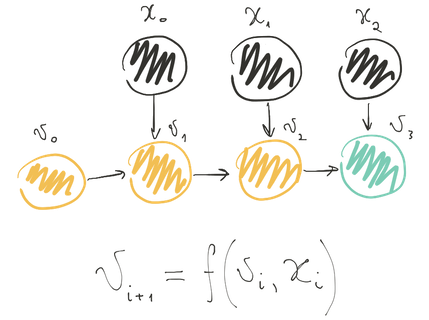
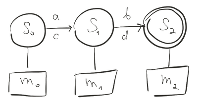
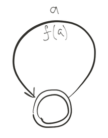
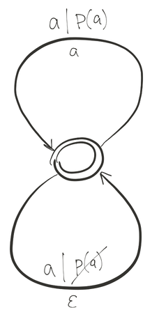
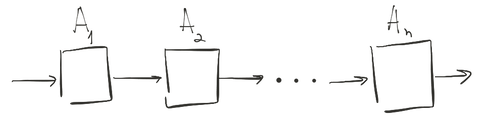
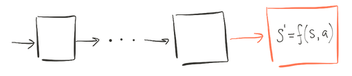
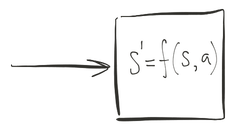

Долой циклы, или Неленивая композиция алгоритмов в C++
======================================================

> "Кто ни разу не ошибался в индексировании цикла, пусть первый бросит в деструкторе исключение."
>
> — Древняя мудрость

Введение
--------

Циклы ужасны. Циклы сложно читать — вместо того, чтобы сразу понять намерение автора, приходится сначала вникать в код, чтобы понять, _что именно_ он делает. В цикле легко ошибиться с индексированием и переопределить индекс цикла во вложенном цикле. Циклы сложно поддерживать, исправлять в случае ошибок, сложно вносить текущие изменения, и т.д. и т.п.

В конце концов, это просто некрасиво.

Человечество издревле пытается упростить написание циклов. Вначале программисты подметили часто повторяющиеся циклы и выделили их в отдельные функции. Затем они придумали ленивые итераторы, а потом и диапазоны. И каждая из этих идей была прорывом. Но, несмотря на это, идеал до сих пор не достигнут, и люди продолжают искать способы улучшить свой код.

Данная работа ставит своей целью пролить свет на отнюдь не новую, но пока что не слишком распространённую идею, которая вполне способна произвести очередной прорыв в области написания программ на языке C++.

Содержание
----------

1.  [Существующие модели](#существующие-модели)
2.  [Свёртка](#свёртка)
    1. [Определение №1: свёртка](#определение-1-свёртка)
    2. [Определение №2: ядро свёртки](#определение-2-ядро-свёртки)
3.  [Идеология](#идеология)
    1.  [Факт №1: каждый цикл можно представить в виде свёртки](#факт-1-каждый-цикл-можно-представить-в-виде-свёртки)
    2.  [Факт №2: большинство циклов расладываются на простые составляющие](#факт-2-большинство-циклов-расладываются-на-простые-составляющие)
    3.  [Факт №3: каждую свёртку можно представить в виде автомата](#факт-3-каждую-свёртку-можно-представить-в-виде-автомата)
    4.  [Факт №4: автоматы комбинируются](#факт-4-автоматы-комбинируются)
    5.  [Снова к свёртке](#снова-к-свёртке)
4.  [Я птичка, мне такое сложно, можно я сразу код посмотрю?](#код)
    1. [Простой пример](#простой-пример)
    2. [constexpr](#constexpr)
5.  [Многопоточность](#многопоточность)
6.  [Сравнительная таблица](#сравнительная-таблица)
7.  [Ссылки](#ссылки)

[Существующие модели](#содержание)
----------------------------------

Основные на текущий момент способы избавления от циклов — это алгоритмы из стандартной библиотеки и ленивые итераторы и диапазоны из библиотек [Boost.Iterator](https://www.boost.org/doc/libs/1_73_0/libs/iterator/doc/index.html), [Boost.Range](https://www.boost.org/doc/libs/1_73_0/libs/range/doc/html/index.html) и [range-v3](https://github.com/ericniebler/range-v3).

> range-v3 частично попали в стандартную библиотеку C++20, но, во-первых, попали они туда в достаточно усечённом виде, а во-вторых, соответствующих реализаций на текущий момент пока нет.

Стандартные алгоритмы прекрасны, и помогают избаваться от циклов, но, к сожалению, только в самых простых случаях, посколько несколько таких алгоритмов невозможно скомбинировать в единое вычисление. Для каждого шага придётся хранить промежуточный результат. А это и перерасход по памяти, и сложности с выводом типов для промежуточных результатов, то есть усложнение кода.

Именно из-за этого появились ленивые итераторы и диапазоны в сторонних библиотеках, а в C++17 появились гибриды семейства [`std::transform_reduce`](https://en.cppreference.com/w/cpp/algorithm/transform_reduce).

Ленивые итераторы и диапазоны решают многие проблемы. Но они сами не лишены своих собственных проблем. В частности, поскольку они отделены от схемы вычислений (они определяют только операции над отдельными элементами последовательности), их сложно параллелить. А стандартные алгоритмы уже с C++17 имеют параллельные версии, способные более эффективно использовать многоядерные архитектуры.

Возникает вопрос: можно ли объединить преимущества обоих подходов одновременно? Оказывается, можно. Об этом и пойдёт речь далее.

[Свёртка](#содержание)
----------------------

Для того, чтобы двинуться далее, необходимо разобраться с тем, что такое *свёртка*.

### [Определение №1: свёртка](#содержание)

*Свёртка* — это вычислительный процесс, производимый над некоторой последовательностью значений по правилу, задаваемому [ядром свёртки](#определение-2-ядро-свёртки).

Результат свёртки — значение, полученное последовательным применением ядра свёртки к текущему значению и очередному элементу последовательности.

### [Определение №2: ядро свёртки](#содержание)

*Ядро свёртки* — это действие, производимое на каждом шаге свёртки. Применяется к текущему значению свёртки и очередному элементу последовательности.



На этом рисунке изображена свёртка последовательности `{x_0, x_1, x_2}` с ядром `f` и начальным значением `v_0`. `v_3` — результат свёртки.

В стандартной библиотеке свёртка представлена алгоритмами [`std::accumulate`](https://en.cppreference.com/w/cpp/algorithm/accumulate) и [`std::reduce`](https://en.cppreference.com/w/cpp/algorithm/reduce).

[Идеология](#содержание)
------------------------

Итак, для того, чтобы понять основную идею данного подхода, нужно обратить внимание на несколько известных фактов.

### [Факт №1: каждый цикл можно представить в виде свёртки](#содержание)

И действительно:

1.  Контекст программы перед началом цикла — начальное значение;
2.  Набор индексов, контейнер, диапазон и т.п. — последовательность элементов;
3.  Итерация цикла — применение двуместной операции (ядра свёртки) к текущему значению и очередному элементу последовательности, в результате чего текущее значение изменяется.

```cpp
auto v = 0;                   // Начальное значение: v_0
for (auto i = 0; i < 10; ++i) // Последовательность: [x_0, x_1, ...]
{
    v = f(v, i);              // Двуместная операция, изменяющая
                              // значение: v_{i + 1} = f(v_i, x_i)
}
```

Иначе говоря, для того, чтобы выразить любой цикл, достаточно базиса из одной единственной операции — свёртки. А все остальные операции — например, стандартные алгоритмы, — можно выразить через неё.

#### Пример №1: отображение через свёртку

```cpp
template <ForwardIterator I, OutputIterator J, UnaryFunction F>
J transform (I begin, I end, J result, F f)
{
    // Начальное значение — это выходной итератор.
    auto initial_value = result;
    // Ядро свёртки.
    auto binary_op =
        [] (auto iterator, auto next_element)
        {
            // Записываем в текущий итератор результат отображения...
            *iterator = f(next_element);
            // ... и возвращаем продвинутый итератор.
            return ++iterator;
        };
    // Свёртка.
    return accumulate(begin, end, initial_value, binary_op);
}
```

#### Пример №2: фильтрация через свёртку

```cpp
template <ForwardIterator I, OutputIterator J, UnaryPredicate P>
J copy_if (I begin, I end, J result, P p)
{
    // Начальное значение.
    auto initial_value = result;
    // Ядро свёртки.
    auto binary_op =
        [p] (auto iterator, auto next_element)
        {
            if (p(next_element))
            {
                *iterator = next_element;
                ++iterator;
            }
            return iterator;
        };
    // Свёртка.
    return accumulate(begin, end, initial_value, binary_op);
}
```

Аналогичным образом выражаются и все остальные последовательные алгоритмы. Любознательный читатель может проделать это в качестве упражнения.

### [Факт №2: большинство циклов расладываются на простые составляющие](#содержание)

Если присмотреться, то станет понятно, что большинство циклов — типовые. Они раскладываются на простые составляющие:

*   Преобразование;
*   Фильтрация;
*   Группировка;
*   Подсчёт;
*   Суммирование;
*   Запись в массив;
*   ...
*   и т.д.

Это значит, что нужно подобрать достаточно выразительный базис операций, чтобы их комбинациями покрыть подавляющее большинство возможных циклов, а также научиться легко и удобно составлять эти комбинации с точки зрения программного кода.

### [Факт №3: каждую свёртку можно представить в виде автомата](#содержание)

По определению, автомат — это система, которая может пребывать в различных состояниях, а переход между этими состояниями происходит при произведении на систему определённого воздействия.

Так, если рассматривать свёртку как автомат, то состояния этого автомата — это совокупность возможных значений переменной, а воздействие — это применение ядра свёртки к текущему значению переменной и очередному элементу последовательности.

>   **Важно:**
>
>   В данной модели рассматривается [обобщение автоматов](https://ru.wikipedia.org/wiki/Абстрактный_автомат), когда есть не только входные символы, под действием которых происходит переход между состояниями, но и выходные символы, сопутствующие этому переходу.
>   На диаграмме входной символ рисуется над стрелками переходов, а выходной — под стрелкой.
>
>   Кроме того, наш автомат может обладать памятью.



#### Пример №1: автомат для отображения

Например, так будет выглядеть автомат для отображения (`transform`, или `map` в функциональном программировании).



Здесь `a` — входной символ, `f` — функция преобразования.

Данный автомат имеет одно состояние и один переход. Каждый входной символ `a` он преобразует с помощью функции `f`, и результат этого преобразования подаёт на выход. После этого возвращается в исходное состояние.

#### Пример №2: автомат для фильтрации



Здесь `a` — входной символ, `p` — предикат, `ε` — обозначение пустого символа.

Данный автомат имеет одно состояние и два перехода. Один переход реализуется тогда, когда входной символ `a` удовлетворяет предикату `p`. В этом случае на выход подаётся сам символ `a`. В случае, если символ `a` не удовлетворяет предикату, на выход подаётся пустой символ (то есть ничего не подаётся). В обоих случаях автомат возвращается в исходное состояние.

### [Факт №4: автоматы комбинируются](#содержание)

Если у автомата есть выход, то, очевидно, этот выход можно подать на вход другому автомату.



Таким образом, имея набор из нескольких автоматов, каждый из которых задаёт одну операцию преобразования, можно составлять достаточно сложные преобразования.

### [Снова к свёртке](#содержание)

Чтобы получить нужную нам свёртку, в конец цепочки мы поставим автомат, который представляет собой ядро свёртки.



Далее заметим, что все автоматы, кроме последнего, как бы подготавливают данные для него, поэтому можно мысленно схлопнуть все автоматы в последний. Получим ядро свёртки. А это и есть тело цикла, который мы и хотели записать.



Итак, мы разложили цикл на простые составляющие и представили с помощью свёртки. В теории всё прекрасно, но как же это будет выглядеть в коде?

[Код](#содержание)
------------------

На основе изложенных выше идей разработана библиотека [Проксима](https://gitlab.com/star-system/proxima).

### [Простой пример](#содержание)


```cpp
#include <proxima/compose.hpp>
#include <proxima/kernel/sum.hpp>
#include <proxima/reduce.hpp>
#include <proxima/transducer/stride.hpp>
#include <proxima/transducer/take_while.hpp>
#include <proxima/transducer/transform.hpp>

#include <cassert>

int main ()
{
    const int items[] = {1, 2, 3, 4, 5};
    const auto kernel =
        proxima::compose
        (
            proxima::transform([] (auto x) {return x * x;}),   // 1. Каждый элемент возведён в квадрат;
            proxima::stride(2),                                // 2. Берутся только элементы с номерами,
                                                               //    кратными двойке (нумерация с нуля);
            proxima::take_while([] (auto x) {return x < 10;}), // 3. Элементы берутся до тех пор, пока
                                                               //    они меньше десяти;
            proxima::sum                                       // 4. Результат суммируется.
        );
    const auto x = proxima::reduce(items, kernel);
    assert(x == 10); // 1 * 1 + 3 * 3
}
```

### [constexpr](#содержание)

Можно отметить, что код из примера может быть выполнен на этапе компиляции:

```cpp
#include <proxima/compose.hpp>
#include <proxima/kernel/sum.hpp>
#include <proxima/reduce.hpp>
#include <proxima/transducer/stride.hpp>
#include <proxima/transducer/take_while.hpp>
#include <proxima/transducer/transform.hpp>

int main ()
{
    constexpr int items[] = {1, 2, 3, 4, 5};
    constexpr auto kernel =
        proxima::compose
        (
            proxima::transform([] (auto x) {return x * x;}),   // 1. Каждый элемент возведён в квадрат;
            proxima::stride(2),                                // 2. Берутся только элементы с номерами,
                                                               //    кратными двойке (нумерация с нуля);
            proxima::take_while([] (auto x) {return x < 10;}), // 3. Элементы берутся до тех пор, пока
                                                               //    они меньше десяти;
            proxima::sum                                       // 4. Результат суммируется.
        );
    constexpr auto x = proxima::reduce(items, kernel);
    static_assert(x == 10); // 1 * 1 + 3 * 3
}
```

Большая часть Проксимы может быть выполнена на этапе компиляции.

[Многопоточность](#содержание)
------------------------------

В Проксиме существует механизм, с помощью которого очень легко распараллеливать вычисления. Это делается с помощью фиктивного преобразователя `pipe`, который выполняет роль "разделителя потоков":

```cpp
proxima::reduce(values,
    proxima::compose
    (
        proxima::for_each(hard_work), // | Поток №1
                                      // ----------
        proxima::pipe,                //            Разделитель потоков
                                      // ----------
        proxima::for_each(hard_work), // | Поток №2
                                      // ----------
        proxima::pipe,                //            Разделитель потоков
                                      // ----------
        proxima::for_each(hard_work), // | Поток №3
        proxima::sum                  // | Поток №3
    ));
```

Запись выше означает, что будут созданы три потока, и в каждом из них будет выполняться только часть работы над очередным элементом последовательности.

Чтобы показать эффективность такого разбиения, рассмотрим пример ([полный код лежит на Гитлабе](https://gitlab.com/star-system/proxima/-/blob/v0.6.1/benchmark/proxima/reduce_hard.cpp)).

В нём будем замерять разницу между распараллеленной в три потока свёрткой, обычной свёрткой и простым циклом. Для имитации "тяжёлых" вычислений сделаем функцию, которая просто засыпает на несколько микросекунд. И сгенерируем набор случайных чисел, которые и будут определять время засыпания.

```cpp
auto hard_work (std::int32_t time_to_sleep)
{
    std::this_thread::sleep_for(std::chrono::microseconds(time_to_sleep));
}

const auto proxima_crunch_parallel =
    [] (auto b, auto e)
    {
        return
            proxima::reduce(b, e,
                proxima::compose
                (
                    proxima::for_each(hard_work),
                    proxima::pipe,
                    proxima::for_each(hard_work),
                    proxima::pipe,
                    proxima::for_each(hard_work),
                    proxima::sum
                ));
    };

const auto proxima_crunch =
    [] (auto b, auto e)
    {
        return
            proxima::reduce(b, e,
                proxima::compose
                (
                    proxima::for_each(hard_work),
                    proxima::for_each(hard_work),
                    proxima::for_each(hard_work),
                    proxima::sum
                ));
    };

const auto loop_crunch =
    [] (auto b, auto e)
    {
        auto sum = typename decltype(b)::value_type{0};
        while (b != e)
        {
            hard_work(*b);
            hard_work(*b);
            hard_work(*b);

            sum += *b;
            ++b;
        }

        return sum;
    };
```

Если сгенерировать 1000 случайных засыпаний в диапазоне от 10 до 20 микросекунд, то получим следующую картину (показано время работы соответствующего обработчика — чем меньше, тем лучше):

```
proxima_crunch_parallel | 0.0403945
proxima_crunch          | 0.100419
loop_crunch             | 0.103092
```

И чем "жирнее" будут вычислительные функции, тем больше будет отрыв многопоточной версии. Например, если взять случайные засыпания в диапазоне от 100 до 200 микросекунд, то картина будет следующей:

```
proxima_crunch_parallel | 0.213352
proxima_crunch          | 0.624727
loop_crunch             | 0.625393
```

То есть почти в три раза быстрее, как было бы при идеальном разложении на три потока.

[Сравнительная таблица](#содержание)
------------------------------------

| Библиотека        | STL (алгоритмы) | Boost     | range-v3     | Проксима  |
|:------------------|:----------------|:----------|:-------------|:----------|
| Компонуемость     | Нет             | Да        | Да           | Да        |
| Вывод типов       | Плохо           | Средне    | Средне       | Хорошо    |
| Параллелизация    | Почти\*         | Нет       | Нет          | Да        |
| Совместимость     | Boost           | STL       | STL          | Всё       |
| Расширяемость     | Сложно          | Нормально | Сложно       | Легко     |
| Самостоятельность | Да              | Да        | Да           | Не совсем |
| constexpr         | Частично        | Нет       | Частично\*\* | Да\*\*\*  |
| Модель            | Монолитная      | Ленивая   | Ленивая      | Неленивая |

> \*) Параллелизация в STL ещё не везде реализована.
>
> \*\*) constexpr диапазонов, видимо, будет лучше, когда они попадут в STL.
>
> \*\*\*) constexpr Проксимы зависит от STL. Всё, что своё — уже constexpr. Всё, что зависит от STL, будет constexpr как только в STL оно будет таковым.


[Ссылки](#содержание)
---------------------

1. [Проксима](https://gitlab.com/star-system/proxima)
2. [Алгоритмы STL](https://en.cppreference.com/w/cpp/algorithm)
3. [atria::xform](https://github.com/Ableton/atria/tree/master/src/atria/xform)
4. [Boost.Iterator](https://www.boost.org/doc/libs/1_73_0/libs/iterator/doc/index.html)
5. [Boost.Range](https://www.boost.org/doc/libs/1_73_0/libs/range/doc/html/index.html)
6. [range-v3](https://github.com/ericniebler/range-v3)
7. [Абстрактный автомат](https://ru.wikipedia.org/wiki/Абстрактный_автомат)
