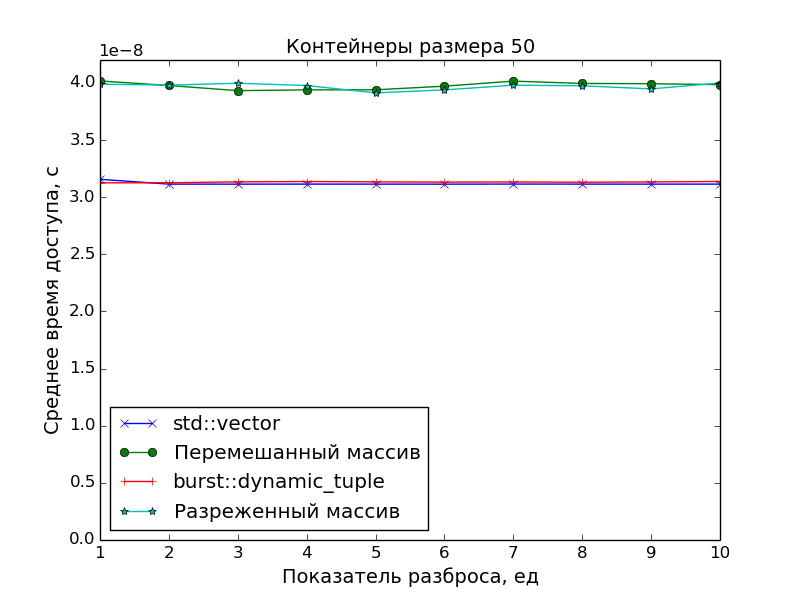

Динамический неоднородный плотно упакованный контейнер
======================================================

**Определение 1**. *Однородный* контейнер – это такой контейнер, в котором хранятся объекты строго одного типа.

**Определение 2**. *Неоднородный* контейнер — это такой контейнер, в котором могут храниться объекты разного типа.

**Определение 3**. *Статический* контейнер — это контейнер, состав которого полностью определяется на этапе компиляции.

> Под *составом* в данном случае понимается количество элементов и их типы, но не сами значения этих элементов. Действительно, бывают контейнеры, у которых даже значения элементов определяются на этапе компиляции, но в данной модели такие контейнеры не рассматриваются.

**Определение 4**. *Динамический* контейнер — это контейнер, состав которого частично или полностью определяется на этапе выполнения.

По такой классификации, очевидно, существуют четыре вида контейнеров:

1.  Статические однородные

    <details><summary>Сможете придумать пример?</summary>

    Обычный массив — `int[n]`.
    </details>

2.  Статические неоднородные

    <details><summary>Примеры?</summary>

    Наиболее яркий пример такого контейнера — это кортеж. В языке C++ он реализуется классом `std::tuple<...>`.
    </details>

3.  Динамические однородные

    <details><summary>Догадались?</summary>

    Правильно, `std::vector<int>`.
    </details>

4.  Динамические неоднородные

    Вот об этом виде контейнеров и пойдёт речь в данной статье.

Содержание
----------

1. [Динамические неоднородные контейнеры](#Динамические-неоднородные-контейнеры)
2. [Динамический кортеж](#Динамический-кортеж)
3. [Хранение данных](#Хранение-данных)
4. [Обработчики](#Обработчики)
5. [Доступ к данным](#Доступ-к-данным)
6. [Время жизни и безопасность исключений](#Время-жизни-и-безопасность-исключений)
7. [Прочие проблемы](#Прочие-проблемы)
8. [Замеры производительности](#Замеры-производительности)
9. [Ссылки](#Ссылки)

## [Динамические неоднородные контейнеры](#Содержание)

Существует несколько техник<a name="tech-orig" href="#tech-foot"><sup>[1]</sup></a> получения динамического неоднородного контейнера. Вот тройка, пожалуй, наиболее распространённых из них:

1.  Массив указателей на полиморфный класс

    Выбор ~~трусабалбеса~~бывалого оопэшника.

    ```cpp
    struct base
    {
        virtual ~base() = default;
        ...
    };

    struct derived: base
    {
        ...
    };

    std::vector<std::unique_ptr<base>> v;
    ```

2.  Массив объединений

    Под объединением может пониматься как языковая возможность `union`, так и библиотечный класс типа `boost::variant` (в C++17 появится `std::variant`).

3.  Массив произвольных объектов с использованием стирания типа

    Например, `boost::any` (В C++17 появится `std::any`), в который можно положить что угодно.

У каждой из этих техник есть свои преимущества и недостатки, и мы их обязательно рассмотрим.
А сейчас пришло время осветить пункт, который до этого момента оставался в тени, несмотря на то, что он является частью названия (и сути) статьи.

**Определение 5**. *Плотно упакованный* контейнер — это такой контейнер, элементы которого лежат в непрерывной области памяти, и между ними нет пропусков (с точностью до выравнивания).

<details><summary>Например? Догадайтесь</summary>

`int[n]`, `std::vector<int>`, `std::tuple<...>`.
</details><br/>

К сожалению, не всякий плотно упакованный контейнер является динамическим неоднородным. А нам нужен именно такой.

Но вернёмся к преимуществам и недостаткам вышеперечисленных техник получения динамических неоднородных контейнеров.

#### Массив указателей на полиморфный класс

Преимущества:

1.  Относительная простота реализации

    Наследование, полиморфизм, все дела. Эти вещи (к счастью или к сожалению?) знает даже новичок.

2.  Лёгко вводить новые сущности

    Не требуется никаких дополнительных действий для того, чтобы получить возможность вставлять новый объект в массив. Нужно только создать нового наследника базового класса.

    И не нужно перекомпилировать код, зависящий от массива указателей.

Недостатки:

1.  Зависимость от иерархии

    В массив можно сложить только объекты, унаследованные от некоторого базового класса.

2.  Избыточность кода

    Для каждого нового элемента требуется создать новый класс в иерархии. То есть если я хочу складывать в контейнер два типа чисел — целые и плавучку, — то мне придётся завести базовый класс "число" и два его соответствующих наследника.

3.  Неплотная упаковка

    В массиве лежат только указатели, а сами объекты разбросаны по памяти. Это, в общем случае, будет негативно влиять на работу с кэшем.

#### Массив объединений

Преимущества:

1.  Независимость от иерархии

    В массив можно положить любой тип, указанный в объединении.

2.  Объекты лежат в непрерывной области памяти

    В массиве хранится не указатель, а сам объект.

Недостатки:

1.  Зависимость от множества объектов, входящих в объединение

    При добавлении нового объекта в объединение нужно перекомпилировать весь код, который явно зависит от нашего массива объединений.

2.  Неплотная упаковка

    Да, объекты лежат в непрерывной области памяти. Но нам хотелось бы получить плотную упаковку, а для этого необходимо, чтобы между объектами не было пустот. А пустоты могут быть.

    Дело в том, что размер объединения равен размеру наибольшего типа этого объединения. Например, если в объединение входит два типа — `X` и `char`, причём `sizeof(X) = 32`, то каждый `char` будет занимать 32 байта, хотя одного было бы вполне достаточно.

#### Массив произвольных объектов с использованием стирания типа

Преимущества:

1.  Полная независимость

    В любой момент в такой массив можно положить любой тип, и не придётся перекомпилировать ничего, что зависит от этого массива.

Недостатки:

1.  Неплотная упаковка

    Как и в случае с массивом указателей, объекты такого массива разбросаны по памяти (в общем случае это не так, потому что может использоваться *оптимизация малых объектов*<a name="soo-orig" href="#soo-foot"><sup>[2]</sup></a>, но для достаточно больших объектов это всегда верно).

## [Динамический кортеж](#Содержание)

Итак, ни один из вышеперечисленных подходов не предполагает плотной упакови. Поэтому нужно разработать ещё один подход к созданию динамического неоднородного контейнера, который, ко всему прочему, обеспечит вожделенную плотную упаковку.

Для того, чтобы это сделать, сначала придётся получше разобраться с `any`. Работа с ним происходит примерно так:

```cpp
int main ()
{
    // Создание новой переменной из экземпляра произвольного типа.
    auto a = any(1);
    assert(any_cast<int>(a) == 1);

    // Доступ к значению.
    any_cast<int>(a) = 42;
    assert(any_cast<int>(a) == 42);

    // Присвоение значения нового типа в старую переменную.
    a = std::string(u8"Привет!");
    assert(any_cast<std::string>(a) == std::string(u8"Привет!"));
}
```

<details><summary>Как это работает? Узнать бесплатно без SMS</summary>

Не принимайте этот код слишком близко к сердцу, это схематичная реализация. За настоящей реализацией следует обратиться к [более авторитетному источнику](https://github.com/gcc-mirror/gcc/blob/master/libstdc%2B%2B-v3/include/experimental/any).

```cpp
#include <cassert>
#include <utility>

enum struct operation_t
{
    clone,
    destroy
};

using manager_t = void (*) (operation_t, const void *, void *&);

// Для каждого типа в момент его укладки в `any` создаётся специальный обработчик, который затем
// будет использоваться для работы с этим типом.
template <typename T>
void manage (operation_t todo, const void * source, void *& destination)
{
    switch (todo)
    {
        case operation_t::clone:
        {
            destination = new T(*static_cast<const T *>(source));
            break;
        }
        case operation_t::destroy:
        {
            assert(source == nullptr);
            static_cast<T *>(destination)->~T();
            break;
        }
    }
}

class any
{
public:
    any ():
        m_data(nullptr),
        m_manager(nullptr)
    {
    }

    any (const any & that):
        m_manager(that.m_manager)
    {
        m_manager(operation_t::clone, that.m_data, this->m_data);
    }

    any & operator = (const any & that)
    {
        any(that).swap(*this);
        return *this;
    }

    any (any && that):
        m_data(that.m_data),
        m_manager(that.m_manager)
    {
        that.m_manager = nullptr;
    }

    any & operator = (any && that)
    {
        any(std::move(that)).swap(*this);
        return *this;
    }

    ~any ()
    {
        clear();
    }

    // Здесь происходит то самое "стирание" типа.
    // Тип объекта в этом месте "забывается", и далее на этапе компиляции его узнать уже
    // невозможно. Однако, благодаря сохранённому обработчику, на этапе исполнения будет
    // известно, как управлять "жизнью" объекта: его копированием и разрушением.
    template <typename T>
    any (T object):
        m_data(new T(std::move(object))),
        m_manager(&manage<T>)
    {
    }

    template <typename T>
    any & operator = (T && object)
    {
        any(std::forward<T>(object)).swap(*this);
        return *this;
    }

    template <typename T>
    friend const T & any_cast (const any & a);

    template <typename T>
    friend T & any_cast (any & a);

    void clear ()
    {
        if (not empty())
        {
            m_manager(operation_t::destroy, nullptr, m_data);
            m_manager = nullptr;
        }
    }

    void swap (any & that)
    {
        std::swap(this->m_data, that.m_data);
        std::swap(this->m_manager, that.m_manager);
    }

    bool empty () const
    {
        return m_manager == nullptr;
    }

private:
    void * m_data;
    manager_t m_manager;
};

// Для того, чтобы достать значение, нужно явно указать его тип.
// Использование:
//
//      `any_cast<int>(a) = 4;`
//
template <typename T>
const T & any_cast (const any & a)
{
    return *static_cast<const T *>(a.m_data);
}

template <typename T>
T & any_cast (any & a)
{
    return *static_cast<T *>(a.m_data);
}
```
</details><br/>

Как вы уже поняли, *динамический кортеж* (ДК) будет развитием идеи с `any`. А именно:
1. Как и в случае с `any`, будет применена техника стирания типа: типы объектов будут "забываться", и для каждого объекта будет заведён "менеджер", который будет знать, как с этим объектом нужно работать.
2. Сами объекты будут уложены друг за другом (с учётом выравнивания) в непрерывную область памяти.

Работать он будет похожим на `any` образом:

```cpp
// Создание первоначального кортежа из произвольного набора элементов.
auto t = dynamic_tuple(42, true, 'q');

// Индикация размера.
assert(t.size() == 3);

// Доступ к элементам по индексу.
assert(t.get<int>(0) == 42);

...

// Добавление новых произвольных элементов.
t.push_back(3.14);
t.push_back(std::string("qwe"));

...

// Модификация имеющихся элементов.
t.get<int>(0) = 17;
```

Нужно больше кода
-----------------

Ну что ж, приступим<a name="letsbegin-orig" href="#letsbegin-foot"><sup>[3]</sup></a>.

## [Хранение данных](#Содержание)

Как следует из определения плотной упаковки, все объекты хранятся в едином непрерывном куске памяти. Это значит, что для каждого из них, помимо обработчиков, нужно хранить его отступ от начала этого куска памяти.

Отлично, заведём для этого специальную структурку:

```cpp
struct object_info_t
{
    std::size_t offset;
    manager_t manage;
};
```

Далее, нужно будет хранить сам кусок памяти, его размер, а также отдельно нужно будет помнить суммарный объём, занимаемый объектами.

Получаем:

```cpp
class dynamic_tuple
{
private:
    using object_info_container_type = std::vector<object_info_t>;

    ...  

    std::size_t m_capacity = 0;
    std::unique_ptr<std::int8_t[]> m_data;

    object_info_container_type m_objects;
    std::size_t m_volume = 0;
};
```

## [Обработчики](#Содержание)

Пока что остаётся неопределённым тип обработчика `manager_t`.

Есть два основных варианта:

1. Структура с "методами"

    Как мы уже знаем по `any`, для управления объектом нужно несколько операций. В случае с ДК это, как минимум, копирование, перенос и разрушение. Для каждой из них нужно завести поле в структуре:

    ```cpp
    struct manager_t
    {
        using copier_type = void (*) (const void *, void *);
        using mover_type = void (*) (void *, void *);
        using destroyer_type = void (*) (void *);

        copier_type copy;
        mover_type move;
        destroyer_type destroy;
    };
    ```

2.  Указатель на обобщённый обработчик

    Можно хранить только один указатель на обобщённый обработчик. В этом случае нужно завести перечисление, отвечающее за выбор требуемой операции, а также привести к единому виду сигнатуры всех возмозных действий над объектом:

    ```cpp
    enum struct operation_t
    {
        copy,
        move,
        destroy
    };

    using manager_t = void (*) (operation_t, const void *, void *);
    ```

Недостаток первого варианта в том, что для каждого действия требуется введение нового поля. Соответственно, память, занимаемая обработчиками будет раздуваться в случае добавления новых обработчиков.

Недостаток второго варианта в том, что сигнатуры разных обработчиков разные, поэтому приходится подгонять все обработчики под единую сигнатуру, при этом, в засисимости от запрошенной операции, некоторые аргументы могут оставаться ненужными, а иногда — о, боги — даже приходится вызывать `const_cast`.

<details><summary>Уведите детей и беременных от экранов</summary>

На самом деле, есть и третий вариант: полиморфные обработчики-классы. Но этот вариант нещадно отметается как самый тормознутый.
</details><br/>

Соответственно, недостатки одного из вариантов — это преимущества другого.

По итогам долгих размышлений и взвешиваний преимуществ и недостатков<a name="thoughts-orig" href="#thoughts-foot"><sup>[4]</sup></a>, недостатки первого варианта перевешивают, и выбор падает на меньшее зло — обобщённый обработчик.

```cpp
template <typename T>
void copy (const void *, void *); // См. раздел "Время жизни и безопасность исключений".

template <typename T>
void move (void * source, void * destination)
{
    new (destination) T(std::move(*static_cast<T *>(source)));
}

template <typename T>
void destroy (void * object)
{
    static_cast<T *>(object)->~T();
}

template <typename T>
void manage (operation_t todo, const void * source, void * destination)
{
    switch (todo)
    {
        case operation_t::copy:
        {
            copy<T>(source, destination);
            break;
        }
        case operation_t::move:
        {
            move<T>(const_cast<void *>(source), destination);
            break;
        }
        case operation_t::destroy:
        {
            assert(source == nullptr);
            destroy<T>(destination);
            break;
        }
    }
}
```

## [Доступ к данным](#Содержание)

Самое простое, что можно сказать про ДК.
Тип запрашиваемых данных известен на этапе компиляции, индекс известен на этапе исполнения, поэтому интерфейс доступа к объекту напрашивается сам собой:

```cpp
template <typename T>
T & get (size_type index)
{
    return *static_cast<T *>(static_cast<void *>(data() + offset_of(index)));
}

size_type offset_of (size_type index) const
{
    return m_objects[index].offset;
}
```

Также, для большей эффективности (см. графики производительности доступа в конце статьи) можно определить доступ к объекту по отступу:

```cpp
template <typename T>
const T & get_by_offset (size_type offset) const
{
    return *static_cast<const T *>(static_cast<const void *>(data() + offset));
}
```

Ну и индикаторы по аналогии со стандартными контейнерами:

```cpp
size_type size () const
{
    return m_objects.size();
}

std::size_t capacity () const
{
    return m_capacity;
}

bool empty () const
{
    return m_objects.empty();
}
```

Единственное, про что нужно сказать отдельно — это особый индикатор, сообщающий *объём* контейнера.
Под объёмом понимается суммарное количество памяти, занимаемое объектами, находящимися в ДК.

```cpp
std::size_t volume () const
{
    return m_volume;
}
```

## [Время жизни и безопасность исключений](#Содержание)

Крайне важные задачи — слежение за временем жизни объектов и обеспечение безопасности исключений.

Поскольку объекты конструируются "вручную" при помощи размещающего `new`, то они, естественно, и разрушаются "вручную" — явным вызовом деструктора.
Это создаёт определённые сложности с копированием и переносом объектов при переаллокации. Поэтому приходится реализовывать относительно сложные конструкции для копирования и переноса:

```cpp
template <typename ForwardIterator>
void move (ForwardIterator first, ForwardIterator last, std::int8_t * source, std::int8_t * destination)
{
    for (auto current = first; current != last; ++current)
    {
        try
        {
            // Пробуем перенести все объекты на новое место.
            current->manage(operation_t::move,
                source + current->offset, destination + current->offset);
        }
        catch (...)
        {
            // Если не получилось, то уничтожаем то, что уже было перенесено.
            destroy(first, current, destination);
            throw;
        }
    }
    destroy(first, last, source);
}

template <typename ForwardIterator>
void copy (ForwardIterator first, ForwardIterator last, const std::int8_t * source, std::int8_t * destination)
{
    for (auto current = first; current != last; ++current)
    {
        try
        {
            // Пробуем скопировать все объекты в новое место.
            current->manage(operation_t::copy,
                source + current->offset, destination + current->offset);
        }
        catch (...)
        {
            // Если что-то пошло не так, то уничтожаем всё, что уже было скопировано.
            destroy(first, current, destination);
            throw;
        }
    }
}
```

## [Прочие проблемы](#Содержание)

Одна из самых больших проблем была с копированием. И, хотя я с ней и разобрался, сомнения всё равно периодически возникают.

Поясню.

Допустим, мы кладём некопируемый объект (скажем, `std::unique_ptr`) в `std::vector`. Мы это можем сделать при помощи переноса. Но если мы попытаемся скопировать вектор, компилятор будет ругаться, потому что внутренние его элементы некопируемы.

В случае с ДК всё несколько иначе:
1. В момент укладки элемента в ДК нужно создать обработчик копирования. Если объект некопируем, то обработчик не может быть создан (ошибка компиляции). При этом ещё неизвестно, собираемся ли мы вообще когда-нибудь копировать наш ДК.
2. В момент собственно копирования ДК информация о копируемости типа — из-за стирания типа — уже недоступна.

В настоящее время выбрано следующее решение проблемы:
1. Если объект копируем, то для него создаётся обычный копирующий обработчик.
2. Если объект некопируем, то для него создаётся особый обработчик, который при попытке копирования бросает исключение.

```cpp
template <typename T>
auto copy (const void * source, void * destination)
    ->
        std::enable_if_t
        <
            std::is_copy_constructible<T>::value
        >
{
    new (destination) T(*static_cast<const T *>(source));
}

template <typename T>
auto copy (const void *, void *)
    ->
        std::enable_if_t
        <
            not std::is_copy_constructible<T>::value
        >
{
    auto type_name = boost::typeindex::ctti_type_index::type_id<T>().pretty_name();
    throw std::runtime_error(u8"Объект типа " + type_name + u8" некопируем");
}
```

Ещё более сложная проблема возникает при сравнении двух ДК на равенство. Можно было бы обойтись тем же способом, но, помимо случая с ошибкой компилятора при попытке сравнить несравнимое, есть ещё случаи, когда компилятор генерирует не ошибку, а предупреждение — например, при вызове оператора равенства для чисел с плавающей точкой. Здесь, с одной стороны, нельзя бросать исключение, потому что пользователь мог осознавать свои действия и производить сравнение намеренно. С другой стороны, хотелось бы всё-таки как-то сообщить пользователю о небезопасной операции.
Эта проблема пока остаётся открытой.

## [Замеры производительности](#Содержание)

Поскольку основной целью было создать именно *плотно упакованный* контейнер, чтобы иметь оптимальное время доступа к его элементам, в замерах производительности сравнивалась скорость доступа в ДК со скоростью доступа в массив указателей на "разбросанные" по памяти объекты.

Применялись две схемы "разбросанности":

1.  Разреженность

    Пусть `N` — размер замеряемого массива, `S` — показатель разброса.
    Тогда генерируется массив указателей размера `N * S`, а затем он прореживается так, что остаются только элементы под номерами `N * i`, `i = 0, 1, 2, ...`.

2.  Перемешанность

    Пусть `N` — размер замеряемого массива, `S` — показатель разброса.
    Тогда генерируется массив размера `N * S`, перемешивается случайным образом, а затем из него выбираются первые `N` элементов, а остальные выбрасываются.

А в качестве точки отсчёта времени доступа был взят `std::vector`.

<details><summary>График: контейнеры размера 10</summary>


</details>

<details><summary>График: контейнеры размера 50</summary>


</details>

<details><summary>График: контейнеры размера 100</summary>


</details>

<details><summary>График: контейнеры размера 200</summary>


</details>

<details><summary>График: контейнеры размера 500</summary>


</details>

<details><summary>График: контейнеры размера 1000</summary>


</details><br/>

Графики подтверждают очевидное:
1. Скорость доступа к элементам ДК идентична скорости доступа к элементам класса `std::vector` (одно сложение указателей и одно разыменование).
2. Доступ к элементам массива указателей медленнее. Особенно это видно на больших массивах при показателе разброса `S > 1`, когда данные перестают помещаться в кэш.

Ссылки
------

Все исходные коды доступны [у меня на гитхабе](https://github.com/izvolov/burst/blob/master/include/burst/container/dynamic_tuple.hpp).

[К содержанию](#Содержание)

----

1. <a name="tech-foot" href="#tech-orig">Техниками я их называю потому, что получившийся контейнер формально является динамическим однородным. Тем не менее, они имитируют желаемый эффект.↩︎</a>
2. <a name="soo-foot" href="#soo-orig">Объект, размер которого не превышает размер указателя, можно хранить в той же области памяти, что и сам указатель.↩︎</a>
3. <a name="letsbegin-foot" href="#letsbegin-orig">Давно пора!↩︎</a>
4. <a name="thoughts-foot" href="#thoughts-orig">Подсмотрел в стандартную библиотеку↩︎</a>
