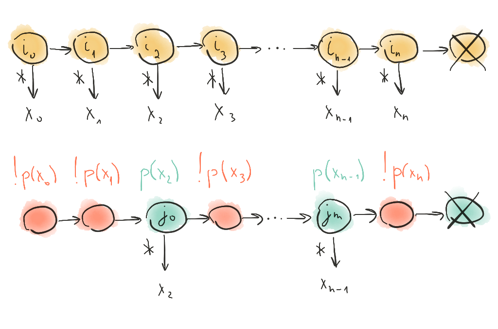

Ленивые итераторы и диапазоны в C++
===================================

Введение
--------

Для того, чтобы упростить написание и чтение кода, программисты периодически придумывают всякие техники. Об одной из таких техник я уже писал в публикации [Долой циклы, или Неленивая композиция алгоритмов в C++](/down-with-loops/down-with-loops.md).

Однако есть и классическая, более распространённая техника для борьбы с циклами — использование итераторов и диапазонов для ленивых операций над последовательностями. Всё это уже сто лет есть в [Бусте](https://www.boost.org/doc/libs/1_75_0/libs/range/doc/html/index.html) и других сторонних библиотеках (к примеру, [range-v3](https://github.com/ericniebler/range-v3)) и постепенно просачивается в [стандартную библиотеку](https://en.cppreference.com/w/cpp/ranges).

>   Хотя, в некотором смысле, и в стандартной библиотеке ленивые итераторы уже есть давно (см. [`std::reverse_iterator`](https://en.cppreference.com/w/cpp/iterator/reverse_iterator)).

Данная публикация — это краткий ликбез о том, что такое ленивые итераторы и диапазоны, зачем они нужны и как ими пользоваться.

Содержание
----------

1.  [Итератор](#итератор)
2.  [Ленивость](#ленивость)
    1.  [Transform Iterator](#transform-iterator)
    2.  [Filter Iterator](#filter-iterator)
3.  [Ленивые диапазоны](#ленивые-диапазоны)
    1.  [Transform Range](#transform-range)
    2.  [Stride](#stride)
4.  [Компоновка](#компоновка)
5.  [Суть итераторов и диапазонов](#суть-итераторов-и-диапазонов)
6.  [Ссылки](#ссылки)

[Итератор](#содержание)
-----------------------

Начнём с простого. Что вообще такое итератор?


Понять суть концепции довольно легко. Сам по себе итератор — это обобщение указателя. При этом главное, что нужно знать — это два способа взаимодействия с итератором:

-   Продвижение (например, `++i` или `i + n`);
-   Разыменование (`*i`).


И в эти взаимодействия мы можем внедряться и переопределять их так, как нам нужно.

[Ленивость](#содержание)
------------------------

Внедрение в операции над диапазонами может быть сколь угодно хитрым и сложным (простые примеры я привёл ниже). Ленивость же состоит в том, что нет никаких промежуточных результатов. Все вычисления происходят только тогда, когда вызываются операции разыменования или продвижения.

**Определение 1**. Итератор `e` *достижим* из итератора `b`, если существует схема `f` продвижения итератора `b` такая, что `f(b) = e`.

Допустим, у нас есть некая последовательность элементов, заданная двумя итераторами: на начало и конец этой последовательности (при этом конец достижим из начала). Теперь мы преобразуем оба этих итератора каким-то способом и получаем два новых итератора. Если преобразование итераторов корректно, т.е. образ конца первой последовательности достижим из образа начала первой последовательности, то мы получили новую последовательность. При этом длина и элементы новой последовательности могут отличаться от длины и элементов исходной.


В этом и состоит ленивость — мы получили новую последовательность без изменений в старой. Мы не трогали хранимые объекты, а только переопределили способ их отображения и обхода по ним.

### [Transform Iterator](#содержание)

Простой пример внедрения в операцию разыменования — это [`boost::transform_iterator`](https://www.boost.org/doc/libs/1_75_0/libs/iterator/doc/transform_iterator.html).

Он оборачивает некий исходный итератор и при разыменовании возвращает результат преобразования над разыменованным значением исходного итератора.


Таким образом, каждому итератору `i` типа `I` мы поставили в соответствие итератор `j` типа `J` такой, что `*j = f(*i)`.

```cpp
auto v = std::vector{1, 2, 3, 4};
//                   2  4  6  8
auto i = v.begin();
auto t = boost::make_transform_iterator(i, [] (auto x) {return x * 2;});

assert(*t == 2);
++t;
assert(*t == 4);
...
```

### [Filter Iterator](#содержание)

Пример внедрения в продвижение — это [`boost::filter_iterator`](https://www.boost.org/doc/libs/1_75_0/libs/iterator/doc/filter_iterator.html).

Он оборачивает продвижение, причём относительно "хитрым" образом. Он выбрасывает из рассмотрения все элементы исходной последовательности, которые не удовлетворяют заданному предикату. Единственное отличие — обёрнутый итератор сразу же позиционируется на нужном элементе, если у исходной последовательности есть префикс, все элементы которого не удовлетворяют предикату.



Таким образом, мы "выбросили" из исходной последовательности итераторы `i` такие, что `p(*i) == false`, и в результирующей последовательности, для каждого итератора `j` типа `J` выполняется `p(*j) == true`.

```cpp
auto v = std::vector{1, 2, 3, 4};
//                      ^     ^
auto i = v.begin();
auto f = boost::make_filter_iterator(i, [] (auto x) {return x % 2 == 0;});

assert(*i == 2);
++i;
assert(*i == 4);
```

[Ленивые диапазоны](#содержание)
--------------------------------

Итератор — это обобщение указателя. Поэтому итератор, как и указатель, сам по себе не знает, когда нужно остановиться. Имея только итератор на начало последовательности, нельзя сказать, где конец этой последовательности. Поэтому мы объединяем пару итераторов — начало и конец — в диапазон.

При этом диапазон — это уже более сложная конструкция, и у него другой интерфейс, похожий на интерфейс контейнеров:

-   Взятие итераторов на начало и конец (`r.begin()`, `r.end()`);
-   Взятие первого элемента диапазона (`r.front()`);
-   Проверка на пустоту (`r.empty()`).

Разница только в том, что диапазон не владеет элементами, которые он задаёт. Хотя бы потому что канонический диапазон — это просто пара итераторов (к примеру, [`std::equal_range`](https://en.cppreference.com/w/cpp/algorithm/equal_range)).

Важно отметить, что диапазон принято задавать полуинтервалом `[b, e)`. Это значит, что итератор-начало `b` указывает на первый элемент последовательности, а итератор-конец `e` указывает на элемент *после* последнего. Таким образом, когда мы приходим в итератор-конец, мы точно знаем, что последовательность закончилась.


### [Transform Range](#содержание)

На основе преобразующих итераторов можно собрать диапазон (см. [`boost::iterator_range`](https://www.boost.org/doc/libs/1_75_0/libs/range/doc/html/range/reference/utilities/iterator_range.html)).

```cpp
auto v = std::vector{...};
auto l = [] (auto x) {return x * x;};
auto tb = boost::make_transform_iterator(v.begin(), l);
auto te = boost::make_transform_iterator(v.end(), l);

auto tr = boost::make_iterator_range(tb, te);

for (auto x: tr)
{
    ...
}
```

Или проще (см. [`boost::transformed`](https://www.boost.org/doc/libs/1_75_0/libs/range/doc/html/range/reference/adaptors/reference/transformed.html)):

```cpp
auto v = std::vector{...};
auto tr = boost::adaptors::transform(v, [] (auto x) {return x * x;});
for (auto x: tr)
{
    ...
}
```

В C++20 это [std::transform_view](https://en.cppreference.com/w/cpp/ranges/transform_view):

```cpp
auto v = std::vector{...};
auto tr = std::ranges::views::transform(v, [] (auto x) {return x * x;});
for (auto x: tr)
{
    ...
}
```

### [Stride](#содержание)

Другой пример ленивого диапазона — это [`boost::strided`](https://www.boost.org/doc/libs/1_75_0/libs/range/doc/html/range/reference/adaptors/reference/strided.html).

Он оборачивает исходный диапазон так, что в новом диапазоне остаются только кратные позиции исходного диапазона.


```cpp
auto v = std::vector{1, 2, 3, 4};
//                   ^     ^
auto s = boost::adaptors::strided(v, 2);

assert(s.front() == 1);
s.advance_begin();
assert(s.front() == 3);
```

[Компоновка](#содержание)
-------------------------

После того, как мы научились создавать диапазоны, нам не составит никакой сложности скомбинировать их в цепочку.

Например, если мы хотим для некоей последовательности чисел:

-   возвести их в квадрат,
-   взять только каждый четвёртый элемент,
-   и оставить только чётные числа,

то можно это сделать так:

```cpp
auto v = std::vector{...};
auto r = v | transformed([] (auto x) {return x * x;})
           | strided(4)
           | filtered([] (auto x) {return x % 2 == 0;});
```

Или, в C++20:

```cpp
auto v = std::vector{...};
auto r = v | std::views::transformed([] (auto x) {return x * x;})
//         | strided(4) // В C++20 такого нет.
           | std::views::filtered([] (auto x) {return x % 2 == 0;});
```

>   Ещё раз хочу подчеркнуть, что этот код не производит никаких вычислений. Он только сохраняет "схемы" работы с диапазоном, а настоящие вычисления будут происходить только во время продвижения или разыменования обёрнутого итератора.

<!-- Таким образом, если для некоторых типов итераторов `I`, `J`, `K` существуют отображения `F: I -> J` и `G: J -> K`, то ничто не мешает построить композицию отображений `G ∘ F: I -> K` такую, что `(G ∘ F)(i) = G(F(i)), i ∈ I`. -->

[Суть итераторов и диапазонов](#содержание)
-------------------------------------------

Помимо C++, в некоторых языках программировани также существует концепция под названием "итератор", но эта концепция зачастую имеет какой-то свой, альтернативный смысл.
К примеру, "итераторы" в языках Java и C# знают свой предел. С точки зрения языка C++ это, скорее, диапазоны.

В C++ итератор — это именно обобщение указателя. По сути [указатель — это самый сильный (или наиболее конкретный) итератор](https://en.cppreference.com/w/cpp/iterator), причём иерархия следующая:

-   Однопроходный итератор (input iterator);
-   Однонаправленный итератор (forward iterator);
-   Двунаправленный итератор (bidirectional iterator);
-   Итератор произвольного доступа (random access iterator);
-   Непрерывный итератор (contiguous iterator);
-   Указатель.

Диапазон же можно рассматривать именно как пару итераторов (даже если это на самом деле не так). Диапазон уже знает, где у него конец, может накладывать дополнительную логику на операции с итераторами и т.д. Также диапазон может быть сконвертирован обратно в итераторы (потому что диапазон — это пара итераторов, как уже было сказано выше).

Такое разделение на итераторы и диапазоны помогает создавать универсальные, гибкие и эффективные интерфейсы для операций над последовательностями.

Один из примеров создания сложной операции над диапазонами я привёл в статье [Ленивые операции над множествами в C++](/lazy-range-operations/lazy-range-operations.md).

[Ссылки](#содержание)
---------------------

-   [Итераторы](https://en.cppreference.com/w/cpp/iterator)
-   [Boost.Iterator](https://www.boost.org/doc/libs/1_75_0/libs/iterator/doc/index.html)
-   [Boost.Range](https://www.boost.org/doc/libs/1_75_0/libs/range/doc/html/index.html)
-   [range-v3](https://github.com/ericniebler/range-v3)
-   [Ranges (C++20)](https://en.cppreference.com/w/cpp/ranges)
