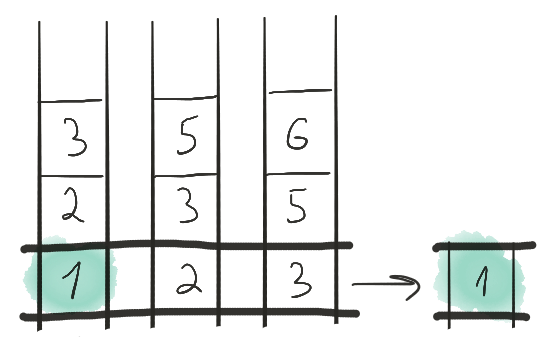
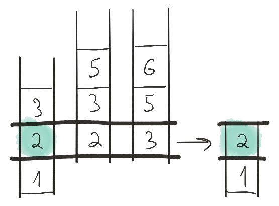
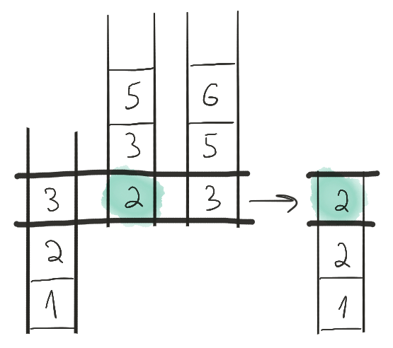
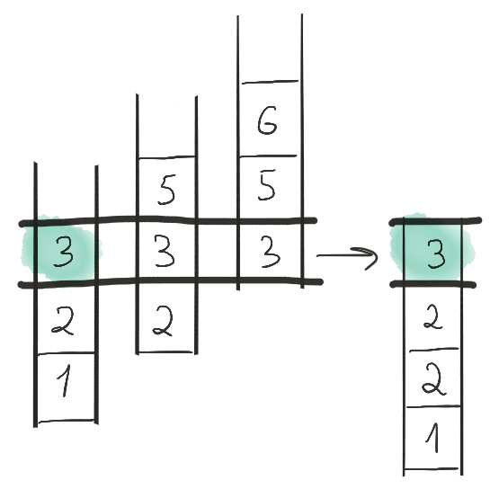
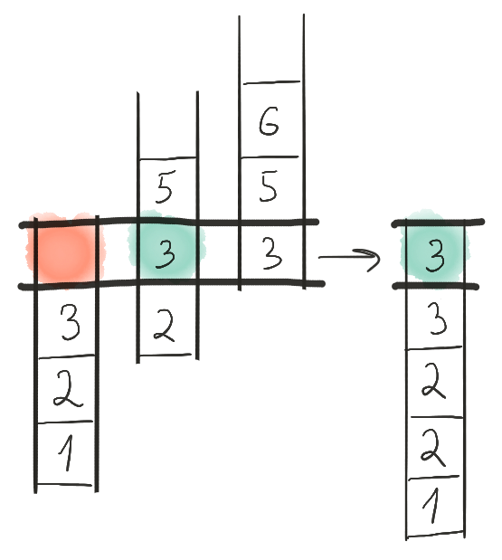

Ленивые операции над множествами в C++
======================================

Введение
--------

В C++ нет понятия "множество". Есть `std::set`, но это всё-таки конкретный контейнер. Есть функции для работы с [упорядоченными диапазонами](https://en.cppreference.com/w/cpp/algorithm): `merge`, `inplace_merge`, `includes`, `set_difference`, `set_intersection`, `set_symmetric_difference`, `set_union`, но это алгоритмы, они не ленивые, и при вызове сразу вычисляют результат. К тому же они предназначены для работы строго с двумя диапазонами.

Что же делать, если, во-первых, диапазонов много (больше двух), а во-вторых, мы хотим вычислять результат не сразу, а по необходимости?

В данной публикации я хочу показать, как спроектировать ленивый диапазон, который будет производить какую-либо операцию с `N` множествами.

>   В публикации [Ленивые итераторы и диапазоны в C++](../lazy-iterators-and-ranges/lazy-iterators-and-ranges.md) я разбирал, что такое ленивые диапазоны.

Содержание
----------

1.  [Операции с несколькими диапазонами](#операции-с-несколькими-диапазонами)
2.  [Алгоритм слияния](#алгоритм-слияния)
3.  [Переложение на итераторы](#переложение-на-итераторы)
4.  [Дизайн](#дизайн)
    1. [Базируется на итераторах](#базируется-на-итераторах)
    2. [Быстрое копирование](#быстрое-копирование)
    3. [Деструктивность по отношению к внутренним диапазонам](#деструктивность-по-отношению-к-внутренним-диапазонам)
    4. [Можно создать диапазон](#можно-создать-диапазон)
    5. [Быстрое создание](#быстрое-создание)
    6. [Изменяемость](#изменяемость)
    7. [Есть адапторы](#есть-адапторы)
5.  [Пример с кодом](#пример-с-кодом)
6.  [Заключение](#заключение)
7.  [Ссылки](#ссылки)

[Операции с несколькими диапазонами](#содержание)
-------------------------------------------------

>   Для начала определимся с терминологией.
>   Множеством я буду называть диапазон, элементы которого упорядочены.
>   Таким образом, первый элемент множества, задаваемого диапазоном с порядком "меньше", — это наименьший элемент этого множества.

Все операции с несколькими множествами сводятся к двум этапам:

-   Продвинуть диапазоны-множества так, чтобы достичь следующего элемента итогового множетсва.
-   Выбрать один элемент среди текущих элементов всех диапазонов-множеств;

Процесс удобно представлять в виде движущихся *входных* лент, с которых выбранные элементы переписываются на *выходную* ленту.

В качестве примера рассмотрим слияние нескольких множеств.

В начале у нас есть три ленты: первая состоит из элементов `{1, 2, 3}`, вторая — из элементов `{2, 3, 5}`, а третья — `{3, 5, 6}`. Текущий элемент каждой ленты — это её первый элемент.

Поскольку нам требуется произвести слияние множеств, то на каждом шаге нужно выбирать наименьший элемент. На первом шаге выбираем элемент `1` на первой ленте и выписываем его на выходную ленту.



После чего продвигаем первую ленту на один элемент. Затем выбираем элемент `2`, снова с первой ленты.



Продвигаем первую ленту. Теперь на первой ленте тройка, а на второй — двойка. Двойка меньше, так что выписываем двойку на выходную ленту, продвигаем вторую ленту.



На этом шаге на всех лентах стоят тройки. Выбираем тройку с первой ленты.



Снова продвигаем первую ленту. После продвижения оказывается, что первая лента закончилась. Это значит, что она выбывает из рассмотрения, и дальнейшие шаги будут произведены только для второй и третьей лент.



И так далее.

В итоге на выходной ленте будет записано `{1, 2, 2, 3, 3, 3, 5, 5, 6}`. Что, собственно, и ожидалось.

>    Мы рассмотрели операцию слияния, однако, нет никаких препятствий для аналогичной реализации объединения, пересечения, симметрической разности и других операций со множествами.

[Алгоритм слияния](#содержание)
-------------------------------

Итак, общая концепция понятна. Но для того, чтобы написать код, нужен алгоритм. Не будем изобретать велосипед, возьмём классический алгоритм слияния `k` списков.

Подготовка:

1.  Определим операцию сравнения двух множеств. Множество `U` будет считаться *меньше* множества `V`, если наименьший элемент множества `U` меньше наименьшего элемента множества `V` (напомню, что наши диапазоны упорядочены, так что наименьший элемент всегда стоит в начале диапазона);
2.  Пустые множества выбросим из рассмотрения;
3.  Сложим множества в [пирамиду (кучу)](https://ru.wikipedia.org/wiki/Куча_(структура_данных)) таким образом, что на вершине пирамиды будет лежать наименьшее множество.

Шаг слияния:

1.  Вынимаем из пирамиды наименьшее множество;
2.  Выписываем наименьший элемент этого множества;
3.  Продвигаем это множество на один элемент вперёд;
4.  Если множество стало пусто, выбрасываем его;
5.  Если множество всё ещё непусто, кладём его обратно в пирамиду.

Таким образом мы выпишем все элементы всех множеств в порядке их неубывания за время `O(k + logk * n)`, где `k` — количество множеств, `n` — суммарный размер всех множеств.

В результате [можно написать следующий код](https://wandbox.org/permlink/41N6KbSaXfw3lVSM).

[Переложение на итераторы](#содержание)
---------------------------------------

Из описания алгоритма и кода видно, что он хорошо разбивается на три части:
1.  Предподготовка;
2.  Выбор текущего элемента (он всегда на вершине пирамиды);
3.  Переход к следующему элементу.

И это прекрасно ложится на то, что мы умеем делать с итераторами, а именно:
1.  Инициализация;
2.  Разыменование;
3.  Продвижение.

Поэтому, долго не думая, берём [Iterator Facade](https://www.boost.org/doc/libs/1_75_0/libs/iterator/doc/iterator_facade.html) и делаем свой итератор.

Код итератора тут: [Burst Merge Iterator](https://github.com/izvolov/burst/blob/master/include/burst/iterator/merge_iterator.hpp).

<!-- Работать с ним так:

```cpp
const auto odd = std::vector{1, 3, 5, 7};
const auto even = std::vector{0, 2, 4, 6, 8};

auto range_to_merge =
    std::vector
    {
        boost::make_iterator_range(odd),
        boost::make_iterator_range(even)
    };

const auto merged_begin =
    burst::make_merge_iterator(range_to_merge);
const auto merged_end =
    burst::make_merge_iterator(burst::iterator::end_tag, merged_begin);
const auto merged_range =
    boost::make_iterator_range(merged_begin, merged_end);

assert(merged_range == {0, 1, 2, 3, 4, 5, 6, 7, 8});
``` -->

[Дизайн](#содержание)
---------------------

Приводить весь код в данной публикации я не буду, но остановлюсь на важных моментах в проектировании итератора слияния.

### [Базируется на итераторах](#содержание)

Исходные множества, которые мы планируем слить воедино, задаются двумя итераторами, то есть одним диапазоном. При этом каждый элемент этого внешнего диапазона — это сам по себе диапазон, то есть одно из тех множеств, которые мы будем сливать (тут можно вспомнить историю про ленты).

Внешний диапазон должен обладать произвольным доступом (random access range) — именно он и будет выступать пирамидой, которую мы будем переупорядочивать в процессе слияния.

Внутренним же диапазонам достаточно однопроходности (input range), поскольку всё, что с ними происходит — это проверка на пустоту, чтение первого элемента и продвижение на одну позицию вперёд.

Результат — итератор слияния — также будет однопроходным (input iterator).

### [Быстрое копирование](#содержание)

Итератор должен быстро копироваться. Все стандартные алгоритмы принимают итератор по значению и не стесняются копировать внутри себя.

Поэтому мы поддерживаем "стандартные" свойства итератора, и не храним в нём никаких развесистых структур. В итераторе слияния хранится только только два итератора на внешний диапазон.

### [Деструктивность по отношению к внутренним диапазонам](#содержание)

То, что итератор слияния не хранит в себе ничего лишнего и быстро копируется, накладывает специфические ограничения. Внешний диапазон, который мы передаём итератору слияния при инициализации, вообще говоря, не владеет контейнерами, которые мы хотим слить, а только ссылается на них. И в процессе работы итератор слияния модифицирует внутренние диапазоны: он же не хранит их в себе, а состояние между вызовами оператора `++` нужно где-то сохранять.

Поэтому для работы итератора слияния нужно создавать отдельное хранилище для внутренних диапазонов, а сами внутренние диапазоны уничтожаются (схлопываются) в процессе продвижения итератора слияния.

Но это не проблема: благодаря этому мы уже получили гибкость и эффективность самого итератора, а организовать красивый интерфейс для обхода явного создания хранилища тоже можно (см. [Быстрое создание](#быстрое-создание)).

### [Можно создать диапазон](#содержание)

Итератор-конец для итератора слияния — это не совсем итератор, а *ограничитель* (*sentinel* в терминах C++20). Простейший пример такого ограничителя — это ноль для классической сишной строки: у нас нет указателя на конец строки, но мы знаем, что если значение разыменованного итератора равно нулю, то это и есть конец строки.

Это значит, что можно не мучить пользователя, и сразу создавать диапазон, минуя создание отдельных итераторов.

```cpp
const auto odd = std::vector{1, 3, 5, 7};
const auto even = std::vector{0, 2, 4, 6, 8};

auto range_to_merge =
    std::vector
    {
        boost::make_iterator_range(odd),
        boost::make_iterator_range(even)
    };
const auto merged_range = burst::merge(range_to_merge);

const auto expected = {0, 1, 2, 3, 4, 5, 6, 7, 8};
assert(merged_range == expected);
```

Код построения диапазона на основе итератора здесь: [Burst Merge](https://github.com/izvolov/burst/blob/master/include/burst/range/merge.hpp)

### [Быстрое создание](#содержание)

По умолчанию итератор слияния конструируется из диапазона (см. выше). Но есть и другая возможность.

Можно просто передать кортеж из ссылок на исходные контейнеры:

```cpp
const auto odd = std::vector{1, 3, 5, 7};
const auto even = std::vector{0, 2, 4, 6, 8};

const auto merged_range = burst::merge(std::tie(odd, even));

const auto expected = {0, 1, 2, 3, 4, 5, 6, 7, 8};
assert(merged_range == expected);
```

В этом случае библиотека берёт на себя создание и обработку промежуточного хранилища для "технических" итераторов.

### [Изменяемость](#содержание)

Полученный итератор слияния однопроходен, но есть нюанс: если исходные диапазоны изменяемы, то результирующий диапазон также можно сделать изменяемым. То есть через ленивый диапазон слияния мы можем модифицировать исходные контейнеры:

```cpp
auto first = std::vector{50, 100};
auto second = std::vector{30, 70};

auto merged_range = burst::merge(std::tie(first, second));
boost::for_each(merged_range, [] (auto & x) { x /= 10; });

assert(first[0] == 10);
assert(first[1] == 5);
assert(second[0] == 7);
assert(second[1] == 3);
```

### [Есть адапторы](#содержание)

Для того, чтобы встраивать полученный ленивый диапазон в цепочку вычислений, есть адаптор, совместимый с [бустовыми адапторами](https://www.boost.org/doc/libs/1_75_0/libs/range/doc/html/range/reference/adaptors/reference.html):

```cpp
const auto first = std::vector{1, 4, 7};
const auto second = std::vector{2, 5, 8};
const auto third = std::forward_list{3, 6, 9};

const auto square = [] (auto x) {return x * x;};

const auto merged =
    std::tie(first, second, third)
        | burst::merged
        | boost::adaptors::transformed(square);

const auto expected = {1, 4, 9, 16, 25, 36, 49, 64, 81};
assert(merged == expected);
```

[Пример с кодом](#содержание)
-----------------------------

Вы спросите: "зачем?!" А я отвечу: для упрощения написания и понимания кода.

Конкретно слияние нескольких упорядоченных диапазонов — довольно полезная операция. С её помощью, например, можно написать [внешнюю сортировку](https://ru.wikipedia.org/wiki/Внешняя_сортировка).

Полный пример внешней сортировки можно почитать здесь: https://wandbox.org/permlink/xhOjmC3sLPpDw9sL

[Заключение](#содержание)
-------------------------

Ленивые операции над множествами — достаточно интересная штука. Можно реализовать слияние, объединение, пересечение, разность, симметрическую разность — в общем, всё, что угодно.

И всё это с сохранением эффективности и достаточно приятного интерфейса.

[Ссылки](#содержание)
---------------------

-   [Ленивые операции над диапазонами в библиотеке Burst](https://github.com/izvolov/burst#ленивые-вычисления-над-диапазонами)
-   [Boost Iterator Facade](https://www.boost.org/doc/libs/1_75_0/libs/iterator/doc/iterator_facade.html)
-   [Boost Range Adaptors](https://www.boost.org/doc/libs/1_75_0/libs/range/doc/html/range/reference/adaptors/introduction.html)
