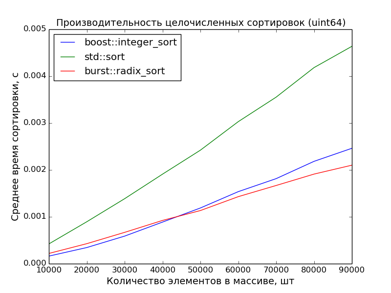

Поразрядная сортировка с человеческим лицом
===========================================

Несмотря на известность алгоритма поразрядной сортировки, в интернете сложно найти приличную его реализацию на языке C++ (честно говоря, думаю, что и на других языках тоже). Почти всё, что находится поисковиками, чудовищно либо в плане кода, либо в плане эффективности. А чаще всего плохо и то, и другое.

Основная ошибка в том, что авторы пытаются навернуть универсальность там, где это не нужно, и не обеспечивают универсальность там, где это действительно необходимо. В результате получается нечто, что работает медленно и чем невозможно пользоваться.

Возможно, именно поэтому многие люди до сих пор считают поразрядку алгоритмом, представляющим исключительно академический интерес, и малоприменимым в реальности. Однако, это заблуждение.

Содержание
----------

1. [Введение](#введение)
2. [Первое приближение](#первое-приближение)
3. [Дополнительная память](#дополнительная-память)
4. [Выделение разрядов из чисел](#выделение-разрядов-из-чисел)
5. [Замеры производительности](#замеры-производительности)
6. [Выводы](#выводы)

[Введение](#содержание)
-----------------------

В последнее время всё же начали появляться сносные варианты поразрядной сортировки. [Один из них](https://github.com/jeremy-murphy/algorithm/tree/radix_sort/include/boost/algorithm/integer_sort) пытался попасть в Буст, но его не пропустили, а [второй](http://www.boost.org/doc/libs/release/libs/sort/doc/html/index.html) даже попал.

Причём, если первый из них просто не очень хорошо спроектирован и реализован, то второй — который попал в буст — вообще не вполне поразрядная сортировка, а некий гибрид, который на малых массивах сводится к вызову `std::sort`. Соответственно, его интерфейс содержит ко всему прочему и функцию сравнения элементов, которую нужно передавать в `std::sort`.

Оба эти варианта, по моему мнению, не дотягивают до истинной, верной, православной поразрядной сортировки ни с точки зрения интерфеса, ни с точки зрения быстродействия.

>   Обратите внимание, что целью статьи не является ни разбор алгоритма, ни подробное описание деталей реализации. Алгоритм рассматривается с точки зрения его "пользовательских характеристик": он дожен быстро работать и им должно быть удобно пользоваться.

Итак, приступим к проектированию.

[Первое приближение](#содержание)
---------------------------------

Чтобы получить грамотный интерфейс, естественно, лучше всего обратиться за просветлением к стандартной библиотеке.

Возьмём стандартный алгоритм `std::sort`. Первый вариант принимает только два итератора. Итераторы задают сортируемый диапазон, а про элементы диапазона известно, что для них определено отношение порядка — оператор "меньше". Этого достаточно, чтобы произвести сортировку.

```cpp
template <typename RandomAccessIterator>
void sort (RandomAccessIterator first, RandomAccessIterator last);
```

А что если оператор "меньше" для элементов не определён или нужно сравнивать элементы как-то по-другому? Тогда пользователь должен сам задать отношение порядка и передать его в качестве третьего аргумента.

```cpp
template <typename RandomAccessIterator, typename Compare>
void sort (RandomAccessIterator first, RandomAccessIterator last, Compare comp);
```

Итак, как же будет выглядеть поразрядная сортировка, если отталкиваться от этого примера? В первом варианте — приблизительно так же. Если известно, что элементы входного диапазона — целые числа, то и вовсе получается то же самое, что и `std::sort`:

```cpp
template <typename RandomAccessIterator>
void radix_sort (RandomAccessIterator first, RandomAccessIterator last);
```

Но что делать, если входные элементы — не числа? Всё просто: нужно задать отображение из этих элементов в числа. Это отображение, так же, как и отношение порядка в `std::sort`, будет третьим аргументом функции.

```cpp
template <typename RandomAccessIterator, typename Map>
void radix_sort (RandomAccessIterator first, RandomAccessIterator last, Map to_integer);
```

Этот интерфейс не предоставляет никакой возможности повлиять на выделение разрядов из чисел. С другой стороны, ясно, что основной массе пользователей-неизвращенцев будет достаточно имеющегося интерфейса, потому что пользователь хочет отсортировать числа, и сделать это быстро. Детали реализации его, как правило, не сильно интересуют.

Значит, все аргументы функции, которые будут связаны непосредственно с выделением разрядов, будут где-то в конце.

Поэтому на данном шаге считаем, что разряды выбираются как-то автоматически, и можно пока отвлечься на другие проблемы.

[Дополнительная память](#содержание)
------------------------------------

Алгоритму поразрядной сортировки для работы требуется дополнительная память:

1.  Массив для хранения промежуточных результатов сортировки по одному разряду
2.  Массив для счётчиков элементов

У проблемы хранения промежуточных результатов два варианта решения:

1.  Выделять память под массив внутри функции
2.  Передавать буфер снаружи

И если немного подумать, то правильное решение очевидно — пользователь должен передавать буфер снаружи. Причём буфер будет задаваться в виде итератора на начало куска памяти, размер которого не менее размера сортируемого диапазона.

1.  Это более гибко

    Пользователь не обязан выделять кусок памяти, строго равный размеру сортируемого диапазона. Если он хочет, то он может выделить один большой кусок и использовать его для сортировки разных по размеру диапазонов.

2.  Это более эффективно

    Если сортировка производится многократно, то достаточно один раз выделить память под буфер, а затем передавать его в сортировку. А сама сортировка не будет тратить драгоценное время на аллокации.

Учитывая выбранное решение, обновлённый интерфейс будет следующим:

```cpp
template <typename RandomAccessIterator1, typename RandomAccessIterator2>
void radix_sort (RandomAccessIterator1 first, RandomAccessIterator1 last, RandomAccessIterator2 buffer);

template <typename RandomAccessIterator1, typename RandomAccessIterator2, typename Map>
void radix_sort (RandomAccessIterator1 first, RandomAccessIterator1 last, RandomAccessIterator2 buffer, Map to_integer);
```

Если же пользователю лень каждый раз создавать перед сортировкой буфер, то он может написать для себя элементарную обёртку:

```cpp
template <typename RandomAccessIterator, typename Map>
void im_too_lazy_to_create_a_buffer_for_the_radix_sort (RandomAccessIterator first, RandomAccessIterator last, Map to_integer)
{
    using value_type = std::iterator_traits<RandomAccessIterator>::value_type;
    std::vector<value_type> buffer(std::distance(first, last));

    radix_sort(first, last, buffer.begin(), to_integer);
}
```

С массивом счётчиков тоже, в принципе, ясно.

Ясно, что работа по вычислению размеров и количества разрядов, выделению нужных массивов под счётчики и передаче этих счётчиков в функцию сортировки слишком сложна, чтобы перекладывать её на пользователя. Пользователь хочет отсортировать массив. Остальное ему не интересно.

И здесь мы подходим к самому важному — проблеме выделения разрядов, и об этом следует поговорить отдельно.

[Выделение разрядов из чисел](#содержание)
------------------------------------------

Любимый способ выделения разрядов большинства горе-разработчиков поразрядных сортировок — это передача в функцию целочисленного основания, остаток от деления на которое и считается одним разрядом. А самое распространённое такое основание — 10. Это можно понять. Но не простить.

Небольшое улучшение этого способа, которое догадываются сделать некоторые разработчики — они берут в качестве основания степень двойки, а в аргументах функции задают уже эту степень, а не само основание. Соответственно, разряд выделяется при помощи битовых операций, что само по себе уже лучше простого деления, но всё ещё плохо.

Некоторые, как, например, автор первого из вышеуказанных примеров, предлагает пользователю задать разрядность и минимальное и максимальное значения одного разряда. Что также неприемлемо, потому что пользователь может легко сломать функцию, передав в неё некорректные или несогласованные параметры.

Итак, чтобы выбрать правильный интерфейс, сформулируем несколько важных мыслей.

1.  Пользователь хочет использовать для сортировки все разряды сортируемых чисел

    Действительно, основной случай — сортировка по первому разряду, потом по второму, по третьему и т.д. до последнего без пропусков.

    Хотя пропуски разрядов или частей разрядов — единственную нетривиальную возможность, которая может понадобиться пользователю от механизма выделения разрядов — устроить можно, и я об этом скажу позже.

2.  Самый лучший разряд — один байт

    На всех процессорах, во всех операционных системах и компиляторах, которые мне удалось проверить, быстрее всего сортировка работает, если за один разряд взять один байт. Для машины это самый удобный случай.

    На самом деле, для сортировки микроскопических массивов (10—20 элементов) восьмибитных чисел будет выгоднее брать в качестве разряда полбайта, но на таких размерах поразрядная сортировка в любом случае уступает (или не особо выигрывает) сортировкам сравнениями, поэтому нас этот случай не интересует.

Основываясь на этих утверждениях, создадим механизм выделения разряда, который будет представлять из себя отображение `radix` из результата функции `to_integer` в целое число. Причём, тип, возвращаемый функцией radix и будет считаться одним разрядом. Например, если radix возвращает `std::uint8_t`, то в качестве разряда будет взят один байт.

Исходя из этого, *на этапе компиляции* можно получить всю необходимую информацию: размер разряда и сдвига для получения следующего разряда (в данном случае — 8), диапазон возможных значений разряда (в данном случае — [0, 256)), количество разрядов в сортируемых числах и т.д.

Это также позволит полностью избавиться от динамической памяти, и даже для счётчиков разрядов завести массивы на стеке.

Окончательный интерфейс будет выглядеть следующим образом:

```cpp
template <typename RandomAccessIterator1, typename RandomAccessIterator2>
void radix_sort (RandomAccessIterator1 first, RandomAccessIterator1 last, RandomAccessIterator2 buffer);

template <typename RandomAccessIterator1, typename RandomAccessIterator2, typename Map>
void radix_sort (RandomAccessIterator1 first, RandomAccessIterator1 last, RandomAccessIterator2 buffer, Map to_integer);

template <typename RandomAccessIterator1, typename RandomAccessIterator2, typename Map, typename Radix>
void radix_sort (RandomAccessIterator1 first, RandomAccessIterator1 last, RandomAccessIterator2 buffer, Map to_integer, Radix radix);
```

Последние два аргумента опциональны. Причём, последний будет использоваться только в каких-то исключительных случаях, а предпоследний — относительно часто. Пожалуй, приблизительно так же, как и отношение порядка в `std::sort`.

По-умолчанию функция `radix` возвращает младший байт числа, а функция `to_integer` является тождественным преобразованием. Таким образом, если сортируются обычные целые числа, ничего дополнительно указывать не надо.

>   Кому интересно, как устроить пропуски разрядов или отдельных цифр при сортировке, — рассказываю. Для этого нужно либо выбросить ненужные биты в отображении `radix`, либо сделать более хитрое отображение `to_integer`, в котором занулить все ненужные цифры.

>   Например, чтобы выбросить старшие полбайта из каждого разряда, отображение radix нужно написать так:

>   ```cpp
>   // Берутся только младшие четыре бита.
>   auto radix = [] (auto x) -> std::uint8_t { return x & 0xf; };
>   ```

[Замеры производительности](#содержание)
----------------------------------------

Чтобы показать, что я не просто теоретизирую, приведу сравнение моей поразрядной сортировки с `std::sort` и `boost::integer_sort`.




Замеры произведены на машине с процессором Core i7 3.40GHz. На ноутбуке с процессором Core 2 Duo 2,26GHz преимущество поразрядной сортировки ещё более очевидно.

[Выводы](#содержание)
---------------------

Преимущества данного подхода к поразрядной сортировке:

1.  Высокое быстродействие по-умолчанию

    Пользователь может пробовать разные варианты, например, брать в качестве разряда `std::uint16_t` или даже `bool`, но, скорее, всего, результат от этого только ухудшится.

2.  Совместимость со стандартной библиотекой

    В алгоритме используется один из основных шаблонов проектирования стандатной библиотеки — итератор. Помимо того, что алгоритм на итераторах удобнее использовать, он ещё и быстрее, чем на контейнерах. Это требует отдельного объяснения, но в рамки данной статьи это не помещается.

    Кроме того, преобразователь (`to_integer`) также знаком пользователю СБШ по таким алгоритмам, как `std::transform`.

3.  Пользователь максимально отстранён от деталей реализации, но сохраняет контроль над происходящим

    Пользователь не может "испортить" алгоритм, передать в функцию некорректные аргументы и т.п. — в худшем случае его код не скомпилируется. В то же время, у него по-прежнему в руках полный контроль над процессом (за исключением тех самых "академических" экспериментов, как, например, "посортировать по основанию 97").

4.  Всё, что можно, делается на этапе компиляции

    В функции не происходит ни одной аллокации. Вся дополнительная память, которая используется, либо приходит извне, либо выделена на стеке.

    Кроме того, шаблонное метапрограммирования позволяет размотать циклы по разрядам, поскольку количество разрядов также известно на этапе компиляции.

Так что поразрядная сортировка — алгоритм, вполне подходящий для практического применения в боевом коде. Шах и мат, "академики"!

Если интересна внутренняя реализация, то [код лежит здесь](https://github.com/izvolov/burst/blob/master/include/burst/algorithm/detail/radix_sort.hpp).

[К началу](#поразрядная-сортировка-с-человеческим-лицом)
